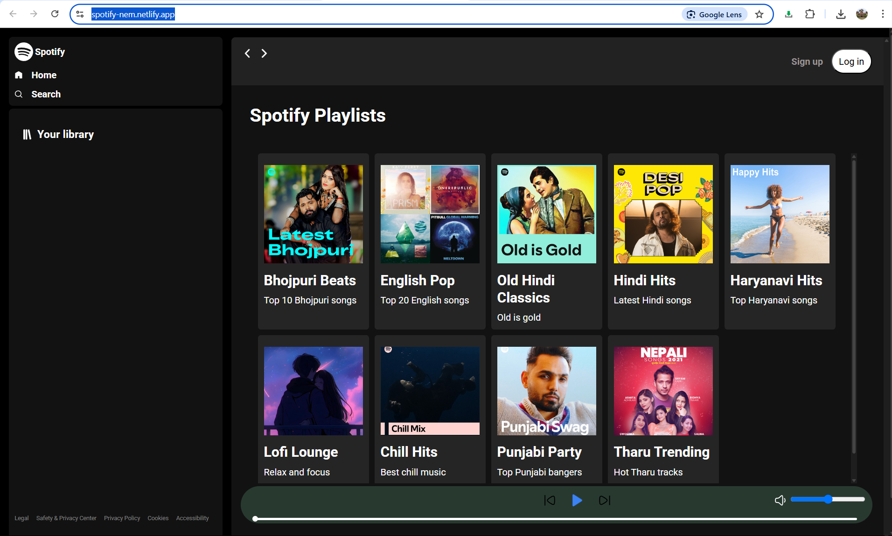

# 🎵 Spotify Clone

A visually stunning and fully functional Spotify-inspired music player built with HTML, CSS, and JavaScript.  
Browse albums, play your favorite tracks, and enjoy a seamless music experience—all in your browser!

---

## 🖼️ Live Demo

🌐 [spotify-nem.netlify.app](https://spotify-nem.netlify.app/)

---

## ✨ Features

- 🎧 **Play, Pause, Next, Previous** controls
- 📚 **Dynamic Album & Song Listing**
- 🎨 **Modern, Responsive UI**
- 🔊 **Volume & Seekbar Controls**
- 📱 **Mobile-friendly Sidebar Navigation**
- 🖼️ **Album Art & Song Info Display**
- 🌙 **Dark Theme Inspired by Spotify**

---

## 🚀 Getting Started

1. **Clone the repository**

   ```bash
   git clone https://github.com/nem-web/Spotify-Clone.git
   cd Spotify-Clone
   ```

2. **Add your music**

   - Place your albums and songs in the `songs/` directory.
   - Update `songs/info.json` with album and song details.

3. **Run locally**
   - Use [Live Server](https://marketplace.visualstudio.com/items?itemName=ritwickdey.LiveServer) in VS Code  
     **OR**
   - Start a simple HTTP server:
     ```bash
     # Python 3.x
     python -m http.server 5500
     ```
   - Open [http://localhost:5500](http://localhost:5500) in your browser.

---

## 📁 Project Structure

```
Spotify-Clone/
│
├── index.html
├── styles.css
├── utils.css
├── script.js
├── img/
│   └── (icons & images)
├── songs/
│   ├── info.json
│   └── (album folders & mp3 files)
└── README.md
```

---

## 🖼️ Screenshots

<!-- Add your screenshot in img/screenshot.png and uncomment below -->
<!--  -->

---

## 🙌 Credits

- UI inspired by [Spotify](https://spotify.com)
- Icons from [Feather Icons](https://feathericons.com/) & [SVG Repo](https://www.svgrepo.com/)
- Built with ❤️ by [Nem](https://github.com/nem-web)

---

## 📜 License

This project is for educational purposes only.  
All music and images belong to their respective owners.

---

**GitHub Repository:**
